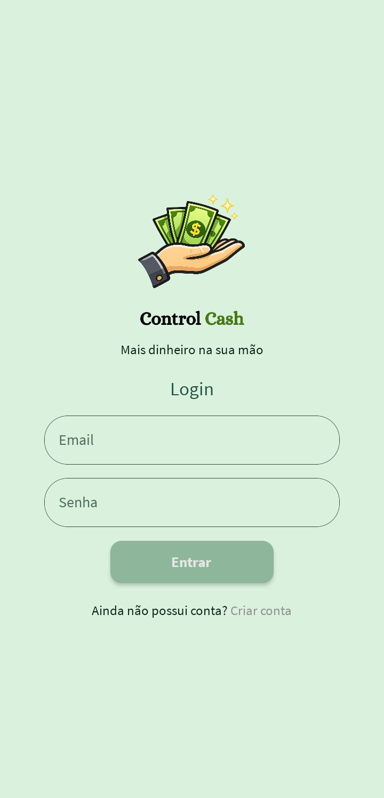
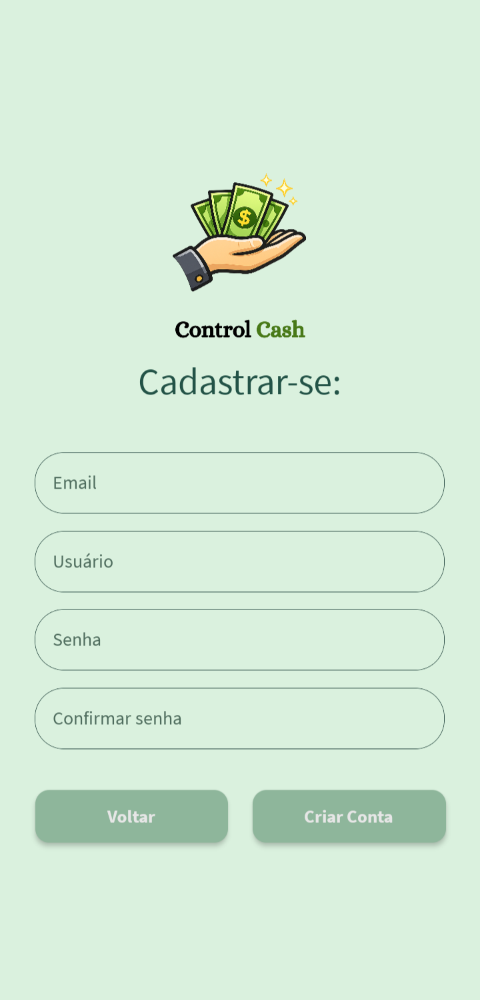
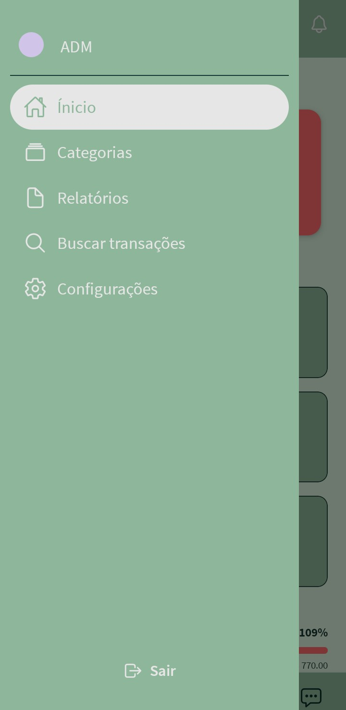
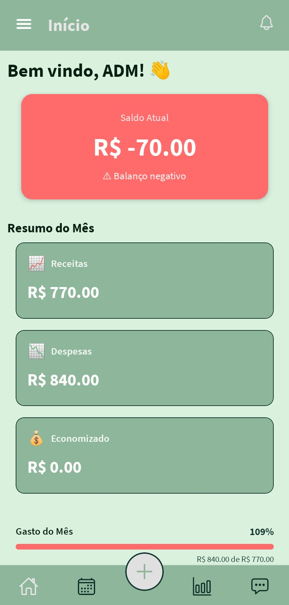
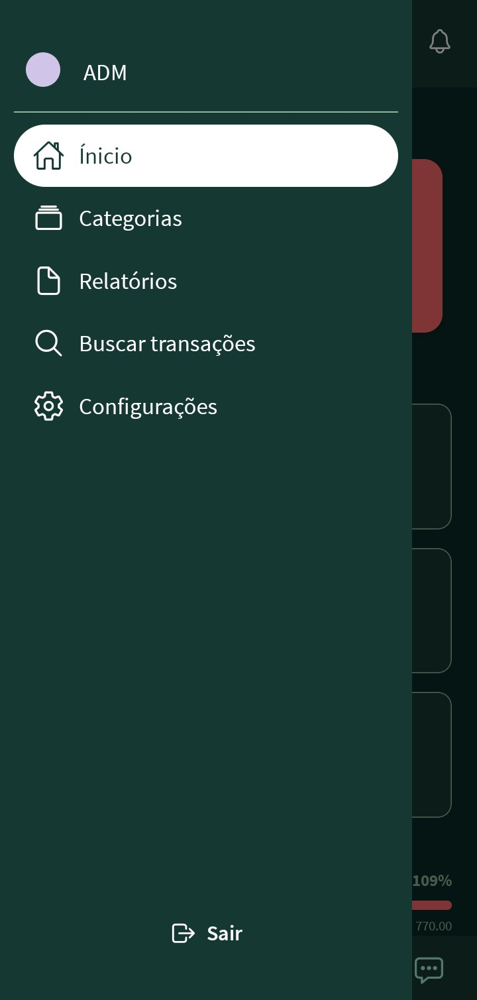
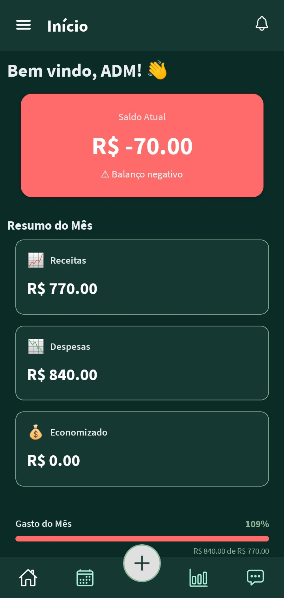

# Control Cash

```md
# 💰 Finance App

Aplicação de gestão financeira pessoal com controle de receitas, despesas,
parcelamentos e notificações em tempo real utilizando React, TypeScript e Firebase.
```


## ✨ Funcionalidades

### Autenticação
- Login
- Cadastro

### Transações
- Receitas
- Despesas
- Filtros

### Dashboard
- Saldo total
- Entradas
- Saídas
- Gráficos

### Notificações
- Contas vencidas
- Próximos vencimentos
- Receitas cadastradas

## 🛠️ Tecnologias

- React
- TypeScript
- Firebase
- Firestore
- Context API
- React Router

## 🏗️ Arquitetura

- Context API para gerenciamento de estado
- Firebase Authentication
- Cloud Firestore
- Services Layer
- Custom Hooks
- TypeScript Types

## 📂 Estrutura do Projeto

```bash
src/
├── components/
├── contexts/
├── hooks/
├── pages/
├── services/
├── types/
├── utils/
└── routes/
````

## 📸 Capturas
### Tela de Login e Cadastro
<p align="center">
  
  
</p>

### Tela de Início e Menu Lateral no modo claro
<p align="center">
   
  
</p>

### Tela de Início e Menu Lateral no modo escuro
<p align="center">
   
  
</p>

## Instalação

1. Clone o projeto
   ```bash
   git clone https://github.com/seuusuario/seuprojeto.git
   ```
   
2. Entre na pasta
   ```bash
   cd seuprojeto
   ```

3. Instale as dependências

   ```bash
   npm install
   ```

2. Execute

   ```bash
   npx expo start
   ```
